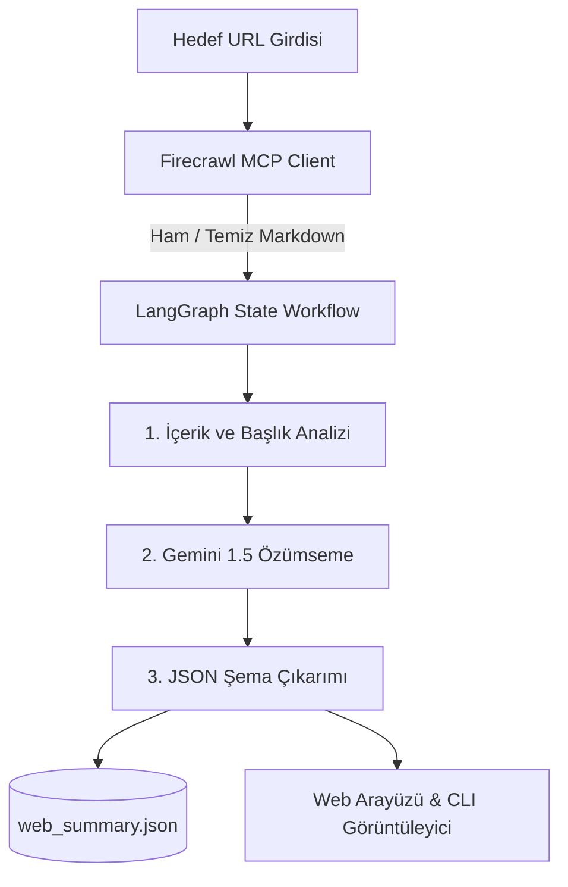

# 🕷️ Firecrawl MCP & LangGraph AI Web Scraper & Summarizer

[](https://www.python.org/)
[](https://fastapi.tiangolo.com/)
[](https://langchain-ai.github.io/langgraph/)
[](https://firecrawl.dev/)
[](https://deepmind.google/technologies/gemini/)
[](https://www.yucelgumus.dev/)

> **Model Context Protocol (MCP)** ve **Firecrawl** entegrasyonu ile web sayfalarını temiz Markdown formatında kazıyan, **LangGraph** tabanlı akıllı ajan döngüsüyle içeriği analiz edip yapılandırılmış JSON özetleri ve anahtar çıkarımlar üreten Agentic AI platformu.

---

## 🌟 Öne Çıkan Özellikler

- 🕸️ **Firecrawl MCP Entegrasyonu:** JavaScript ile dinamik yüklenen modern web sitelerini dahi DOM gürültüsünden arındırarak saf Markdown ve metin olarak kazıma.
- 🔄 **LangGraph Döngüsel Ajan Mimarisi:** Kazıma (Scrape) ➔ Temizleme (Clean) ➔ Analiz (Analyze) ➔ Yapılandırılmış Çıkarım (Structured Extraction) aşamalarından oluşan otonom iş akışı.
- 📊 **Yapılandırılmış JSON & Rapor Üretimi:** Web sayfasının ana fikrini, temel istatistiklerini, hedef kitlesini ve eylem maddelerini standart JSON formatında dışa aktarma (`web_summary.json`).
- 🖥️ **Çift Kullanım Modu (CLI & Web UI):** İster terminal üzerinden hızlı komut satırı aracı (`main.py`), ister FastAPI & Jinja2 tabanlı modern web arayüzü (`app.py`).
- ⚡ **Benchmark & Performans İzleme:** Kazıma sürelerini ve token verimliliğini ölçen yerleşik kıyaslama sistemi (`benchmark_results.json`).

---

## 🏗️ Mimari & LangGraph Ajan Akışı



---

## 🚀 Hızlı Başlangıç

### Gereksinimler
- **Python**: 3.10 veya üstü
- **Firecrawl API Key** & **Google Gemini API Key**

### Kurulum

```bash
git clone https://github.com/yucel-gumus/Firecrawl_MCP-Gemini-LangGraph.git
cd Firecrawl_MCP-Gemini-LangGraph

# Sanal ortam
python3 -m venv .venv
source .venv/bin/activate

# Bağımlılıklar
pip install -r requirements.txt
```

### Ortam Değişkenleri (`.env`)

```env
FIRECRAWL_API_KEY=your_firecrawl_api_key
GEMINI_API_KEY=your_gemini_api_key
```

### Çalıştırma

**Komut Satırı (CLI) Modu:**
```bash
python main.py --url https://example.com
```

**Web Arayüzü (FastAPI) Modu:**
```bash
python app.py
```
Arayüze `http://localhost:8000` adresinden erişebilirsiniz.

---

## 📂 Proje Dizin Yapısı

```
Firecrawl_MCP-Gemini-LangGraph/
├── requirements.txt
├── app.py                          # FastAPI Web sunucusu
├── main.py                         # CLI ve LangGraph motoru
├── benchmark_results.json          # Performans analiz verileri
├── web_summary.json                # Üretilen son yapısal özet
└── templates/
    └── index.html                  # Web arayüzü şablonu
```

---

## 📄 Lisans
Bu proje [MIT Lisansı](LICENSE) ile lisanslanmıştır.

---

## 👨‍💻 Geliştirici & İletişim

**Yücel Gümüş** - Full Stack Developer

- 🌐 **Web Sitesi / Portfolyo:** [yucelgumus.dev](https://www.yucelgumus.dev/)
- 💼 **LinkedIn:** [linkedin.com/in/yucel-gumus](https://www.linkedin.com/in/yucel-gumus/)
- 🐙 **GitHub:** [@yucel-gumus](https://github.com/yucel-gumus)

<p align="left">
  <a href="https://www.yucelgumus.dev/" target="_blank" rel="noopener noreferrer">
    
  </a>
</p>